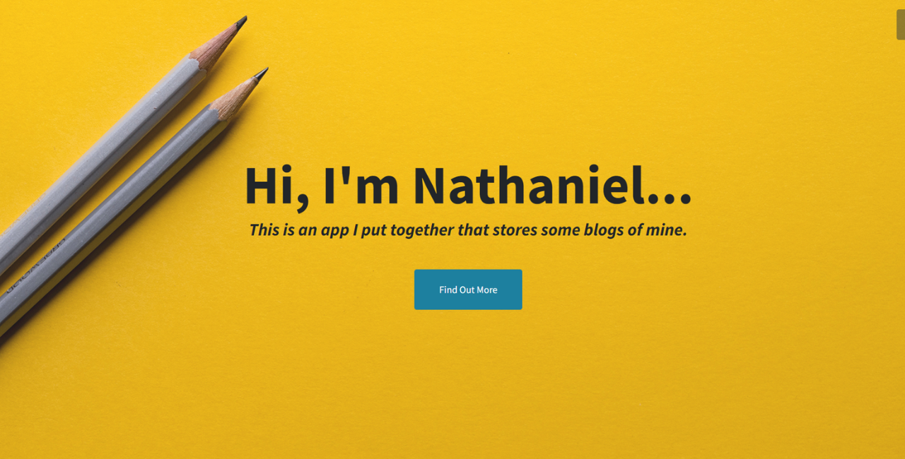

# A Django Blog Website

A webapp that holds multiple blogs of different topics in one place.
I built it with Django to practice and improve my skill with the technology.

I still need to figure out a way to host a live version of the webapp.
The setback is that I don't have a credit card to use a paid service.


# Table of contents

- [Project Title](#project-title)
- [Demo-Preview](#demo-preview)
- [Table of contents](#table-of-contents)
- [Installation](#installation)
- [Usage](#usage)
- [Development](#development)
- [License](#license)
- [Footer](#footer)

# Installation

<video src='https://i.imgur.com/0JC9qMY.mp4'>
</video>

To use this project, first clone the repo on your device using the command below:

```
git clone https://github.com/nathanieladiah/blogs.git
```

Then `cd` into the directory.

```
cd blogs
```

Create a virtual environment and activate. (I use venv, so this could be accomplished with):

```
python -m venv .env

.env/scripts/activate
```

Install the dependencies:

```
pip install -r requirements.txt
```

Create a superuser

```
python manage.py createsuperuser
```

Then run database migrations

```
python manage.py migrate
```

And run the server

```
python manage.py runserver
```

[(Back to top)](#table-of-contents)

# Usage

[(Back to top)](#table-of-contents)

# Development

## Features

- [x] Have multiple blogs based on different topics:

  - Nathaniel writes a book
  - Doing CS50 Games
  - General Blog

- [x] Only my user will be able to create blog items

- [ ] Other users can login to write comments

- [x] There should be a homepage which can show all the blogs available,

- [x] Then for each blog, there should be another home page:

  - A featured post
  - A list of blog posts, most recent first

- [x] Each blog post should have a title, the contents, and a comment section.

[(Back to top)](#table-of-contents)

# License

[(Back to top)](#table-of-contents)

[GNU General Public License version 3](https://opensource.org/licenses/GPL-3.0)


